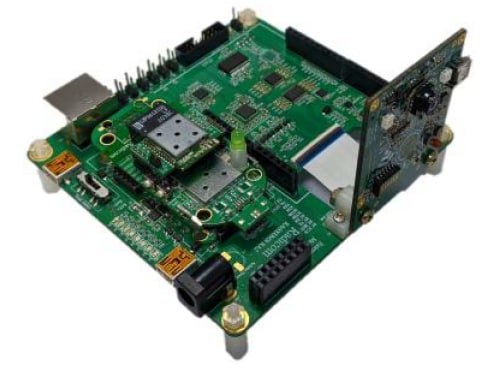
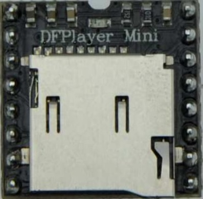
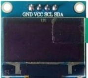
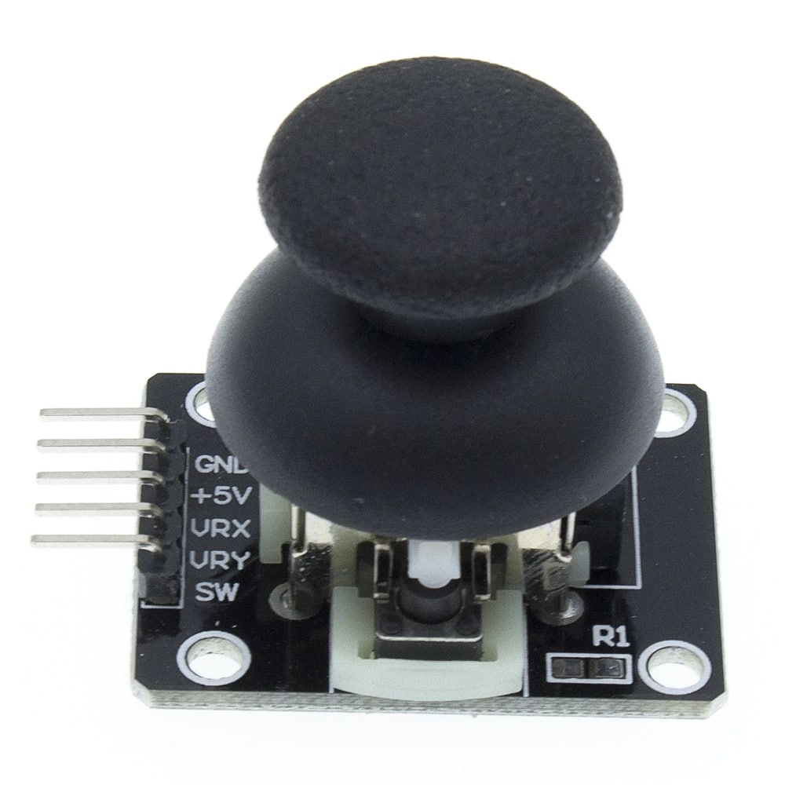
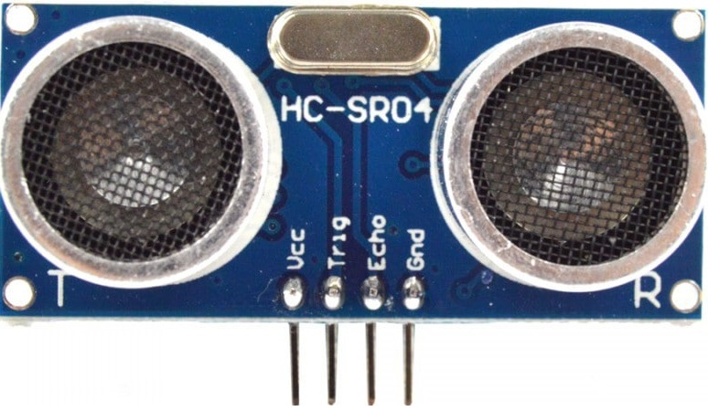
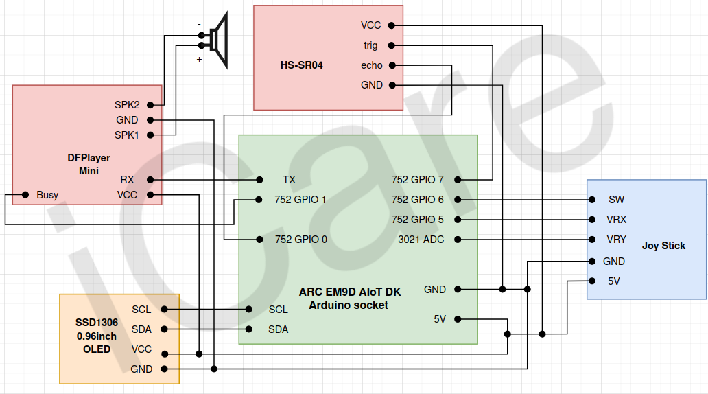

# 1)Introduction
Our work is Smart Medication Use Support System. The purpose is to help the elderly solve problem of forgetting to take medicine， our work can identify how many times a day the medicine should be taken that written on the medicine bag to remind the user to take the medicine at the specified time.
# 2)HW/SW Setup


### Overview of hardwares:

*  ARC EM9D AIoT DK
    * Endpoint AI development board
    * Support Tensorflow Lite module with built-in AI accelrator
    * Take picture with built-in camera
    * Arduino socket for data transmission



*  DFPlayer mini
    * Serve as audio output to instruct user what to do
    * Read and play audio files in micro sd cards
    * Connect with an 3W speaker to generate sound
    * Using arduino uart and gpio to communicate with board




* SSD1306 OLED
    * Serve as visual output to instruct user what to do
    * Display menu for user to choose function
    * Using IPS to communicate with board



* JoyStick
    * Serve as user input device
    * Read Up/Down/Left/Switch from user to interact with OLED menu
    * Using ADC and gpio to communicate with board



* HC-SR04
    * Serve as watch dog to monitor if medicine bag is moved

### Schematic Diagram

Connect all components as picture show.


### Compile the prog
(Please use following cmd in linux system only, you need to download [Synopsys_SDK_V22.01/](https://arc.synopsys.com.tw/resourceDetail/6) by yourself beforehand.)
```bash
$ git clone https://github.com/ARC-AIOT/Hardware
$ mv Hardware Synopsys_SDK_V22.01/
$ cd Synopsys_SDK_V22.01/Hardware/combine
$ make && make flash
```
Upload the prog to the board (see instruction below), press the rst btn and enjoy  
### Upload the prog
1. Use 'make' and 'make flash' command in cygwin and ubuntu to get the image file
2. Short J11 and J20
3. Burn the image file into the board
4. Open J11 and J20
5. Press the reset button to initialize the system

# 3)User Manual

### Basic Flow
1. After pressing reset button,set up the time by 'Time setting'
2. Choose 'text detect' to ask the device read information
3. If recognization success then go on,if failed back to step 2
4. Choose your next medication time
5. Take medicine on time with the notification of our device  
6. If you want to put a new bag of medicine, just start from step 2

### The detail instruction of each step can be found below

### Function Overview
* Time setting:
    Setup system time
* text detect:
    Using camera to recognize proper frequency to take medicine
* When to take med:
    Show and read out when you should take medicine next time  

**Mind:**   
    One should setup system time before using text detect to ensure the system work properly.  

### Main menu
You should see the menu from OLED like this once you open the device:  
```
+---------------------+
|Sat Jan 1 2022       |
|00:00                |
|> time setting       |
|  text detect        |
|  When to take med   |
|                     |
|                     |
+---------------------+
```
You can use joystick to select the function you want, cursor will move based on joystick state.  
```
+----------+         +----------+
|          |   Joy   |          |
|          |  Stick  | Up       |
|          |         |          |
|          v         |          |
|    +-----+---------+-----+    |
|    |Sat Jan 1 2022       |    |
|    |00:00                |    |
|    |> time setting       |    |
|    |  text detect        |    |
|    |  When to take med   |    |
|    |                     |    |
|    |                     |    |
|    +-----+---------------+    |
|          |                    |
|          |   Joy              |
|     Down |  Stick             |
|          |                    |
|          v                    |
|    +-----+---------------+    |
|    |Sat Jan 1 2022       |    |
|    |00:00                |    |
|    |  time setting       |    |
|    |> text detect        |    |
|    |  When to take med   |    |
|    |                     |    |
|    |                     |    |
|    +-----+---------+-----+    |
|          |         ^          |
|          |   Joy   |          |
|     Down |  Stick  | Up       |
|          |         |          |
|          v         |          |
|    +-----+---------+-----+    |
|    |Sat Jan 1 2022       |    |
|    |00:00                |    |
|    |  time setting       |    |
|    |  text detect        |    |
|    |> When to take med   |    |
|    |                     |    |
|    |                     |    |
|    +-----+---------+-----+    |
|          |         ^          |
|          |   Joy   |          |
|     Down |  Stick  |          |
|          |         |          |
+----------+         +----------+
```
### Function Usage:
* Time setting:
move cursor to the "time setting" funct and press the btn  
```
+---------------------+
|Sat Jan 1 2022       |
|00:00                |
|> time setting       |
|  text detect        |
|  When to take med   |
|                     |
|                     |
+---------------------+
```
And you can use joystick to set system time.  
Use up/down to increase/decrease time  
Press the button to comfirm a time setting.  
```
                              +---------------------+       +---------------------+       +---------------------+       +---------------------+       +---------------------+
                              |                     |       |                     |       |                     |       |                     |       |                     |
                              |                     |       |                     |       |                     |       |                     |       |                     |
                              |years:               |       |month:               |       |Day:                 |       |Time:                |       |Time:                |
                              |2023                 |       |02                   |       |02                   |       |01:XX                |       |XX:01                |
                              |                     |       |                     |       |                     |       |                     |       |                     |
                              |                     |       |                     |       |                     |       |                     |       |                     |
                              |                     |       |                     |       |                     |       |                     |       |                     |
                              +---------------+-----+       +---------------+-----+       +---------------+-----+       +---------------+-----+       +---------------+-----+
                                        Joy   ^                       Joy   ^                       Joy   ^                       Joy   ^                       Joy   ^
                                       Stick  | Up                   Stick  | Up                   Stick  | Up                   Stick  | Up                   Stick  | Up
                                              |                             |                             |                             |                             |
                                              |                             |                             |                             |                             |
+---------------------+       +---------------+-----+       +---------------+-----+       +---------------+-----+       +---------------+-----+       +---------------+-----+
|Sat Jan 1 2022       |       |                     |       |                     |       |                     |       |                     |       |                     |
|00:00                | Press |                     | Press |                     | Press |                     | Press |                     | Press |                     |
|> time setting       |  Btn  |years:               |  Btn  |month:               |  Btn  |Day:                 |  Btn  |Time:                |  Btn  |Time:                |
|  text detect        +------>|2022                 +------>|01                   +------>|01                   +------>|00:XX                +------>|XX:00                |
|  When to take med   |       |                     |       |                     |       |                     |       |                     |       |                     |
|                     |       |                     |       |                     |       |                     |       |                     |       |                     |
|                     |       |                     |       |                     |       |                     |       |                     |       |                     |
+---------------------+       +-----+---------------+       +-----+---------------+       +-----+---------------+       +-----+---------------+       +-----+---------------+
                                    |   Joy                       |   Joy                       |   Joy                       |   Joy                       |   Joy
                               Down |  Stick                 Down |  Stick                 Down |  Stick                 Down |  Stick                 Down |  Stick
                                    |                             |                             |                             |                             |
                                    v                             v                             v                             v                             v
                              +-----+---------------+       +-----+---------------+       +-----+---------------+       +-----+---------------+       +-----+---------------+
                              |                     |       |                     |       |                     |       |                     |       |                     |
                              |                     |       |                     |       |                     |       |                     |       |                     |
                              |years:               |       |month:               |       |Day:                 |       |Time:                |       |Time:                |
                              |2021                 |       |12                   |       |31                   |       |23:XX                |       |XX:59                |
                              |                     |       |                     |       |(might be 28/29/30,  |       |                     |       |                     |
                              |                     |       |                     |       | based on month)     |       |                     |       |                     |
                              |                     |       |                     |       |                     |       |                     |       |                     |
                              +---------------------+       +---------------------+       +---------------------+       +---------------------+       +---------------------+

```
* Text detect:
text detect:  
move cursor to the "text detect" funct and press the btn  
```
+---------------------+
|Sat Jan 1 2022       |
|00:00                |
|  time setting       |
|> text detect        |
|  When to take med   |
|                     |
|                     |
+---------------------+
```
Put medicine bag in front of camera, then press button to start detect.  
There will be two situation:  
1. Detect failed.   
You will hear the device indicate you the detection is failed, check if you put the medicine bag well and make sure it is flatted welled without wrinkles.  
You can back to menu by move joystick left.  
After everything is setup perfectly, select "text detect" to detect text again.  
```
+---------------------+       +---------------------+
|Sat Jan 1 2022       | Press |Sat Jan 1 2022       |
|00:00                |  Btn  |00:00                |
|  time setting       +------>|                     |
|> text detect        |       |                     |
|  When to take med   |<------+                     |
|                     | Stick |                     |
|                     | left  |<- back              |
+---------------------+       +---------------------+
(The failed detect audio will be played)
* Flow diagram if detect failed
```
2. Detect success.  
You will hear the device indicate you the detection result (proper freq to take medicine), then the device would display a menu for you to choose your next medication time.  
Move joystick Up/Down to select when will you take medicine next time, press btn to ensure your selection.  
After you select next time to take the med, the device will show your selection on screen and read out lout.  
Then, after few sec, you'll hear the device saying: "Please put medicine bag into the box." and show "Put med into box" on screen.  
Please put the bag in front of HC-SR04, otherwise you'll hear the device keeping saying: "Please put medicine bag into the box."  
until you do so.
You can back to menu by move joystick left after all.  
```
+---------------------+       +---------------------+       +---------------------+       +---------------------+
|Sat Jan 1 2022       |       |Sat Jan 1 2022       |       |Sat Jan 1 2022       | After |Sat Jan 1 2022       |
|00:00                | Press |00:00                | Press |00:00                |  few  |00:00                |
|  time setting       |  Btn  |                     |  Btn  |Next time to take med|  sec  |Put med into box     |
|> text detect        +------>|> After breakfast    +------>|After breakfast      +------>|                     |
|  When to take med   |       |  After lunch        |       |                     |       |                     |
|                     |       |  After dinner       |       |                     |       |                     |
|                     |       |  Before sleep       |       |                     |       |<- back              |
+----------+----------+       +---------------------+       +---------------------+       +----------+----------+
           ^                  (Play the detect result)       (Play the sel by user)                  |(Keeping playing 
           |                                                                                         |"put med into box")
           |                                                                                         |
           +-----------------------------------------------------------------------------------------+
                                                Stick left
* Flow diagram if detect success
```
**Mind:**  
Mind that once you use the detect text function successfully, HC-SR04 will monitor if you move the 
medicine bag ceaselessly.  
Once you were caught, the device will start Keeping playing audio "Put med into box" over and over again until you put the bag back.

* When to take med  
There will be two situation:  
1. You haven't use detect text before or the nearest time you FAILED to detect text.  
You'll hear device ask you go to "detect text" function first, the device will also show this indication on screen.  
You can back to menu by move joystick left.  
```
+---------------------+       +---------------------+
|Sat Jan 1 2022       | Press |                     |
|00:00                |  Btn  |                     |
|  time setting       +------>|Please go to         |
|  text detect        |       |text detect first    |
|> When to take med   |<------+                     |
|                     | Stick |                     |
|                     | left  |<- back              |
+---------------------+       +---------------------+
                        (Play audio "Please go detect text first")
* Flow diagram if you haven't use detect text before or the nearest time you FAILED to detect text.
```


2. You have detect text SUCCESSFULLY before  
The device will read out when you should take medicine next time, those info will also show on screen.  
You can back to menu by move joystick left.  
```
+---------------------+       +---------------------+
|Sat Jan 1 2022       | Press |Sat Jan 1 2022       |
|00:00                |  Btn  |00:00                |
|  time setting       +------>|You have already     |
|  text detect        |       |taken med before     |
|> When to take med   |<------+Next time to take:   |
|                     | Stick |xx:xx                |
|                     | left  |<- back              |
+---------------------+       +---------------------+
                        (Read out when you should take med)
* Flow diagram if you have detect text SUCCESSFULLY before.  
```


